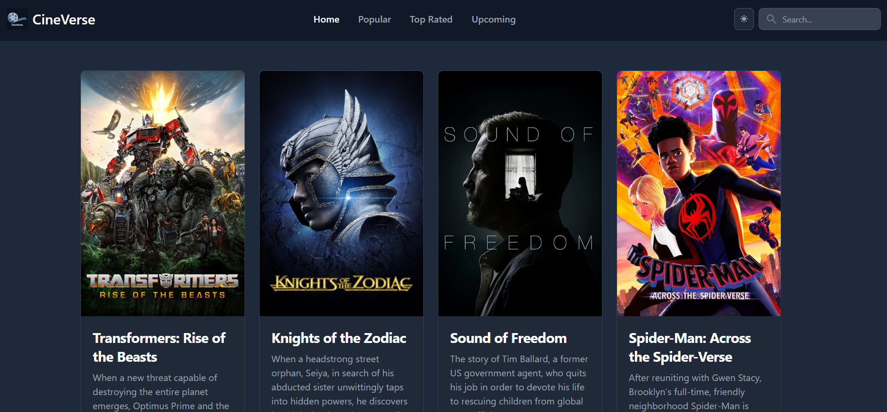

🎬 CineVerse - Lights, Camera, React! 🎥

Welcome to CineVerse, your go-to movie paradise! This is not just your average movie information website; it's a passion project born out of love for films and the desire to create a fun, immersive experience for all movie buffs out there. With a mix of custom hooks, React Router, and a touch of movie magic, CineVerse is here to revolutionize the way you explore and enjoy the world of cinema.

## Features

🌟 **Discover Movies**: CineVerse brings the silver screen to your fingertips. Explore a vast library of movies, including popular releases, upcoming gems, and everything in between. Thanks to the power of the TMDB API integration, you can browse through a rich collection of movie information, including captivating images and enticing descriptions.

🎭 **Genre Galore**: Dive into the heart of different genres and unearth hidden treasures waiting to be discovered. Whether you're in the mood for comedy, drama, action, or something entirely different, CineVerse has you covered. Explore genre-specific movie lists and expand your cinematic horizons.

🔍 **Smart Search**: Looking for a specific movie? Our handy search feature lets you find your favorites in a snap. Simply enter the movie title, hit enter, and watch as CineVerse presents you with tailored search results. It's like having your very own personal movie detective!

🔥 **Enhanced Movie Details**: Clicking on a movie from the search results takes you to a whole new level of movie magic. CineVerse seamlessly navigates to a dedicated page that provides an in-depth look at the movie's details, including a comprehensive overview, cast and crew information, ratings, and more. It's like getting an exclusive backstage pass to your favorite films.

🎉 **Custom Hooks Awesomeness**: CineVerse utilizes the power of custom hooks to make your movie browsing experience smoother and more efficient. These custom hooks optimize code reuse, manage state, and provide dynamic functionality, ensuring that your journey through CineVerse is both engaging and lightning-fast.

🌐 **React Router Dom**: With the help of React Router Dom, CineVerse enables seamless navigation throughout the application. From the home page to genre-specific movie lists, each section has its own unique URL, allowing for direct access and easy sharing. Get ready to surf through the cinematic waves!

## Contributing

Pull requests are welcome! If you have any suggestions, new features, or bug fixes to contribute, feel free to submit a pull request. Let's work together to make CineVerse the ultimate movie hub for cinephiles worldwide!

## Feedback and Support

We value your feedback and are here to help if you encounter any issues. If you have any questions, suggestions, or just want to say hello, please don't hesitate to reach out to our friendly support team at cineverse-support@example.com.

So, what are you waiting for? Grab your popcorn, dim the lights, and join us on this exciting cinematic adventure. CineVerse is your gateway to an unforgettable movie experience like no other. Happy exploring, and may the movies be with you! 🍿🎉
